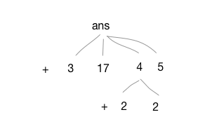
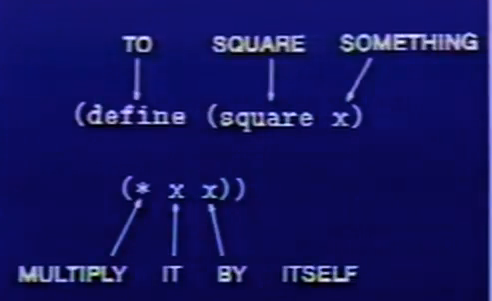
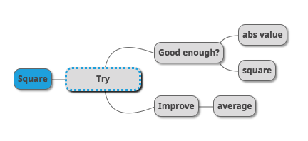

---

## Subtitution model


> 替換的目的是爲了幫助我們瞭解過程調用那些函數的情況。

<br>

替換模型其實就是代入變數求值的過程。

```lisp
(define square (*  x x))

(+ (square 6) (square 10)) ;return 136

;使用square 的定義上面其實可以變成
(+ (* 6 6) (* 10 10))

;使用算法又會變成
(+ 36 100)

;最後得到
136

;這種過程就叫做替換模型
```

<br>


## Black box absctraction

> 裏面是上面不要緊，所以它才叫做黑盒子

<br>

把東西封裝起來。輸入數據，得到結果，對要得到結果的人，在這個黑盒子裏面的東西是什麼並不要緊。把黑色盒子抽象化，是爲了要能夠建造更大的盒子。 

另一個原因是，你可以用自己的方法，封裝impretivitive procedure在這個黑盒子內，比方說要找到某數的平方根, 除了用最小差的方式來計算之外，也可以用$$y$$ 和$$ x/y$$的平均來逼近計算。

你可以輸入$$x$$, 得到這個數值，在把這個黑盒子跟求平方根的盒子封裝在一起。

<br>


## Conventional interfaces

> 用統一的接口控制複雜度

<br>

如何對不同資料進行加法？

對兩個元素進行加法，得使用不同的方法，比方說，相加兩個數字，跟相加兩個多項式的方法就不一樣。如果真的要做一個通用的加法，我們要如何選擇組合，如果明天又有不同的元素出現，那要怎麼讓新的元素也可以在這個系統內被導入？而不把原本的系統搞爛？

到底要如何控制複雜度？答案就是透過統一的接口，像電器插頭一樣，如果用符合標準化的東西來建構系統，就可以把各部分的組件組合在一起。

<br>


## Metaliguistic abstraction
除了上面兩個方法，也可以透過創造一個新的語言來控制複雜度。


如果有人要跟你展示一項新語言，你應該問他？
> What are the primitive elements? 
> what are the means of combination and build bigger things at them ？

與其問他，如果要反轉一個矩陣需要寫多少程式碼，反而應該問他，如果這個語言沒有提供矩陣之類的東西，那要怎麼用你的語言建立矩陣？怎麼用組合的方式來建造矩陣？怎麼抽象化他們？好把他們模組化用來建造更複雜的東西。

<br>


## 介紹Lisp

$+, 3 , 17.4, 5$ 這些都是基本元素，

$(+, 3 17, (+ 2 2), 5)$這是組合，$+$是運算符，而$3, 17.4, 5$這些叫做`operands`運算對象

可以把這種組合想成其實在建構一棵樹，這種lambda的括號只是一種表達方式而已。

<br>



<br>


#### 定義變數 

```lisp
(DEFINE A (* 5 5 ))
```

操作符在最前面，參數在後面。


<br>


#### 定義一個function

Define 一種通用的方式，讓輸出等於輸入的平方。

```lisp
(DEFINE (SQURE X) (* X X) )
(SQURE 10)  // return 100
```

<br>



<br>

```lisp
(define square 
	(lambda (x) (* x x ) ))

;lambda = make a procedure
;(*  x x) return multiplying x by x	
```


<br>

上面這兩種方法其實輸出一樣，上面省略lambda的版本只是一種語法糖，讓輸入的方式更方便一點。


<br>

下方是求任何數絕對值的函數

```
abs(x) =  -x  for  x < 0
0 for x =0
x for x > 0
```

<br>


用lisp來寫就會變成

```lisp
(define (abs x)
        (cond ((< x 0) (-x))
              ((> x 0) (x))
              ((x = 0) (0))))
```

<br>

這是條件表達式的一般形式，上面是一個示範if statement的範例。


突然，老師說到這裏差不多已經夠瞭解`lisp`，可以拿來做數值運算了，但根本呢沒有`for loop`阿，怎麼辦到得呢？就以亞歷山大求解平方根的過程來示範這個magic吧。

<br>

#### 亞歷山大的求解平方根做法

1. 猜一個數值G
2. 以G和X/G的平均數來決定新的G，因爲
3. 一直重複上面的過程一直到G已經足夠接近
4. 以1來做一開始始猜測的數值G

<br>

所以到底怎樣才可以沒有loop就找到？答案就是透過**遞迴**。

<br>

```lisp
(define (Try Guess X)              ;放兩個變數到Try這個procedure中
    
 (If (good-enough? Guess X)        ;如果 這個個變數guess, x good-enough ? 
     
      Guess                        ;繼續猜
     
      (Try (improve Guess X) X)))  ;然後放一個遞迴的函數進來比較。

(DEFINE (Square x) (Try 1 X))      ;先從1開始猜起，x是要尋找square root的值。
```

<br>

  ```lisp
;;;;透過平方guess x兩個傳回新的猜測值

(define (improve guess x)
       (average guess ( / x guess)))
  ```

<br>

```lisp
;;;;會return true or false, 看猜測的值的平方和x之間的差距是不是夠小？因爲猜測的值的理應是x的平方根。

(define (good-enough? guess x)
         (< (abs ( - (square guess) x)  .001)))

```

<br>

而最終可以把這樣的程序寫成一顆樹

<br>





<br>

也可以把所有的程序都封裝起來到黑盒子內，如果只是想知道$x$的平方根的人只要輸入$x$即可。

```lisp
(define (square x)
    (define (improve guess)
        (average guess (/ x guess)))
    (define (good-enough? guess)
        ( < (abs ( -  (square guess) x )) .001))
    (define (try guess)
        (if (good-enough? guess)
             guess ;if true
             (try (improve guess)))) ;if false
    (try 1))   
```


## 練習

C1 solutions


